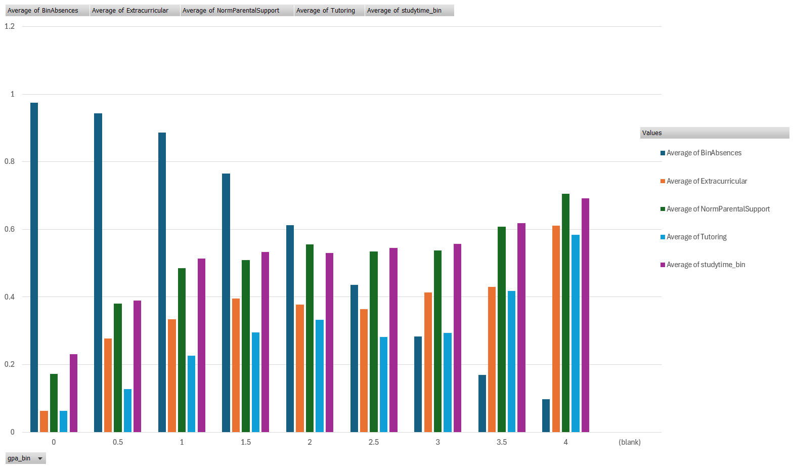
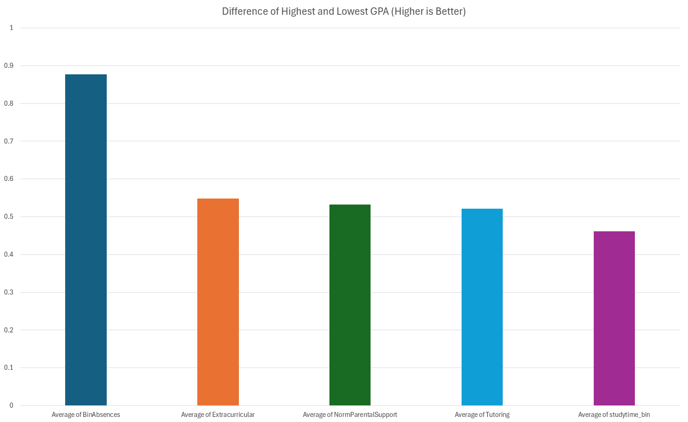
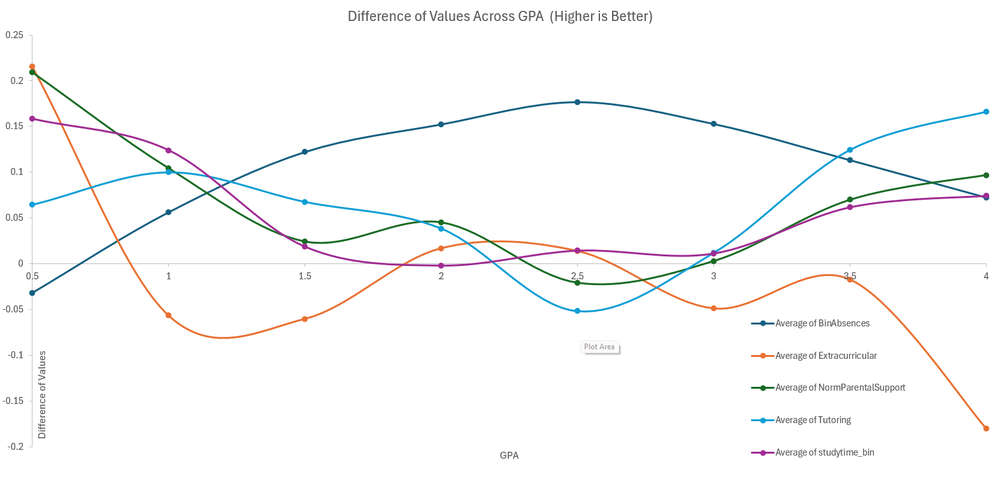

# Excel Data Analysis Project
## Overview
This project involves analyzing the Student Performance dataset, which provides detailed information on high school students. The dataset includes variables such as StudentID, Age, Gender, Ethnicity, Parental Education, Study Time Weekly, Absences, Tutoring, Parental Support, Extracurricular Activities, Sports, Music, Volunteering, GPA, and Grade Class. The objective of this analysis is to identify the factors most strongly correlated with GPA, thereby highlighting key areas for prioritization to enhance student performance. While GPA is an imperfect measure of overall success, it serves as a useful proxy for academic achievement when considered alongside a comprehensive set of variables. The goal is to determine which variables are most correlated with GPA, and these will be identified as the most critical areas for intervention.

## Methodology
Data Cleaning: The dataset was thoroughly cleaned to ensure accuracy, including the removal of empty cells and formatting of data into correct types. Additional standard data cleaning practices were applied to prepare the dataset for analysis.

#### Exploratory Data Analysis: 
The analysis involved mapping each variable in relation to GPA to identify correlations. For binary variables, the average was taken to assess its impact on GPA. Data normalization was performed to facilitate direct comparisons, as the focus is on correlation rather than raw values.

#### Visualization: 
To enhance clarity, GPA and other continuous variables were binned. Various visualizations, including scatter plots with connected delta values, were created to illustrate the correlation between variables and GPA. The most linearly correlated variables were identified as the most significant factors for improving student performance. Visualizations were designed to clearly show the magnitude of these correlations, emphasizing the "bigger is better" approach to prioritization.

## Key Findings
Absences: 
The most important variable by a significant margin is the number of absences. Regular attendance is crucial for academic success, as students must be present to benefit from the educational opportunities provided.

Extracurricular Activities, Parental Support, and Tutoring: Following absences, these factors were identified as the next most influential. They highlight the importance of holistic engagement in a student’s education.

Actionable Insights: The findings suggest that schools can directly impact student performance by focusing on attendance and encouraging participation in extracurricular activities. This underscores the importance of fostering student engagement through both in-class attendance and extracurricular involvement.

## Visualizations

## Conclusion
The analysis reveals that several factors contribute to academic success, with school attendance and extracurricular participation being the most critical. Schools should prioritize strategies that improve attendance and promote extracurricular involvement, as these are strongly correlated with higher GPA. One possible explanation for the importance of extracurricular activities is their role in fostering teamwork and school engagement, which in turn may reduce absenteeism. Additionally, while solitary study is important, the data suggests that the collective benefits of extracurricular participation may have a more substantial impact on academic achievement.

#### Files
analysis.xlsx: The Excel file containing all data and analysis.
